# dsh-auto-handoff 程序执行流程图

> 本文只描述**代码实际执行路径**，每个节点都对应仓库里的真实函数，行号随源码更新可能漂移。
> 配置项含义、阈值语义、错误文案见 `README.md`；设计缘由见 `TASK-PLAN.md`。

---

## 0. 运行面总览

插件由**两个互相独立的半边**组成，通过一条 HTTP 前缀路由通信，进程边界就是它们的边界：

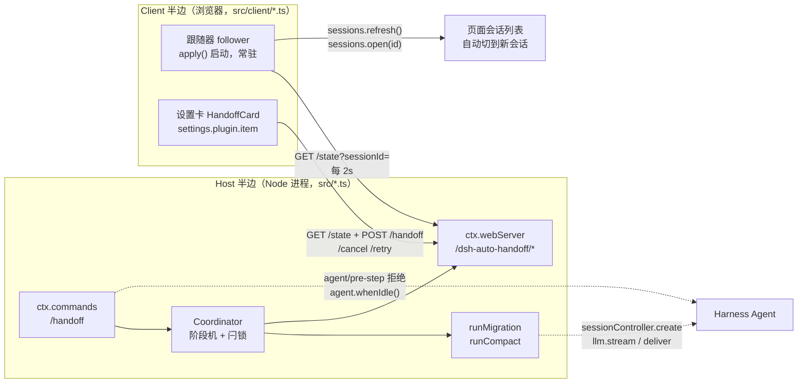
```mermaid
flowchart LR
  subgraph HOST["Host 半边（Node 进程，src/*.ts）"]
    CMD["ctx.commands<br/>/handoff"]
    CO["Coordinator<br/>阶段机 + 闩锁"]
    MIG["runMigration<br/>runCompact"]
    RT["ctx.webServer<br/>/dsh-auto-handoff/*"]
    CMD --> CO --> MIG
    CO --> RT
  end
  subgraph CLIENT["Client 半边（浏览器，src/client/*.ts）"]
    FOL["跟随器 follower<br/>apply() 启动，常驻"]
    CARD["设置卡 HandoffCard<br/>settings.plugin.item"]
  end
  FOL -->|"GET /state?sessionId=<br/>每 2s"| RT
  CARD -->|"GET /state + POST /handoff<br/>/cancel /retry"| RT
  FOL -->|"sessions.refresh()<br/>sessions.open(id)"| UI["页面会话列表<br/>自动切到新会话"]
  CMD -.->|"agent/pre-step 拒绝<br/>agent.whenIdle()"| AG["Harness Agent"]
  MIG -.->|"sessionController.create<br/>llm.stream / deliver"| AG
```

要点：

- **没有任何 Host↔Client RPC 通道**，唯一的跨界媒介是 `fetch` + JSON 标量；
- 跟随器由 `client/index.ts:54` 的 `apply()` 启动，**不依赖设置卡是否挂载**（这正是「迁移后不自动跳转」的根因修复）；
- 协调器状态（`StateStore`）是**进程内内存**，`dsh web` 重启即丢失，仅影响闩锁与最近结果。

---

## 1. 装配时序（Host `apply()`，src/index.ts:201）

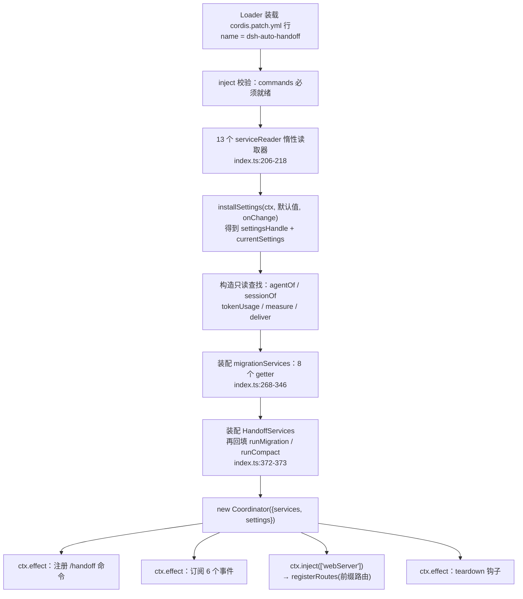
```mermaid
flowchart TD
  A["Loader 装载 cordis.patch.yml 行<br/>name = dsh-auto-handoff"] --> B["inject 校验：commands 必须就绪"]
  B --> C["13 个 serviceReader 惰性读取器<br/>index.ts:206-218"]
  C --> D["installSettings(ctx, 默认值, onChange)<br/>得到 settingsHandle + currentSettings"]
  D --> E["构造只读查找：agentOf / sessionOf<br/>tokenUsage / measure / deliver"]
  E --> F["装配 migrationServices：8 个 getter<br/>index.ts:268-346"]
  F --> G["装配 HandoffServices<br/>再回填 runMigration / runCompact<br/>index.ts:372-373"]
  G --> H["new Coordinator({services, settings})"]
  H --> I["ctx.effect：注册 /handoff 命令"]
  H --> J["ctx.effect：订阅 6 个事件"]
  H --> K["ctx.inject(['webServer'])<br/>→ registerRoutes(前缀路由)"]
  H --> L["ctx.effect：teardown 钩子"]
```

### 1.1 为什么全部是 getter 而不是快照

Loader 用 `Promise.allSettled` 并发装配同层条目，**带 `inject` 的行会停在 PENDING**，所以 `sessionController`（自身注入 10 个服务）几乎总是**晚于本插件 `apply()` 返回**才发布。一次性 `ctx.get` 会把健康部署误判成「本部署未安装 sessionController」。

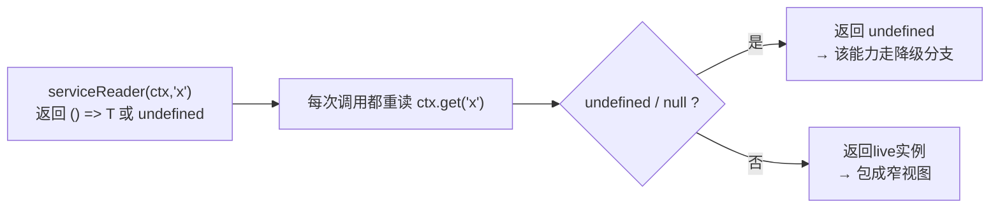
```mermaid
flowchart LR
  S["serviceReader(ctx,'x')<br/>返回 () =&gt; T 或 undefined"] --> R["每次调用都重读 ctx.get('x')"]
  R --> V{"undefined / null ?"}
  V -->|是| U["返回 undefined<br/>→ 该能力走降级分支"]
  V -->|否| T["返回live实例<br/>→ 包成窄视图"]
```

### 1.2 Realm 隔离：`forAgent()` 的双平面解析

Web 面在 `dsh-web-app/cordis.patch.yml` 里**关掉了 Host 平面的 `plan-mode` 与 `compaction-basic`**，改由每个 agent preset 在自己的 `isolate` realm 内挂载。realm 对组外的行不可见，所以：

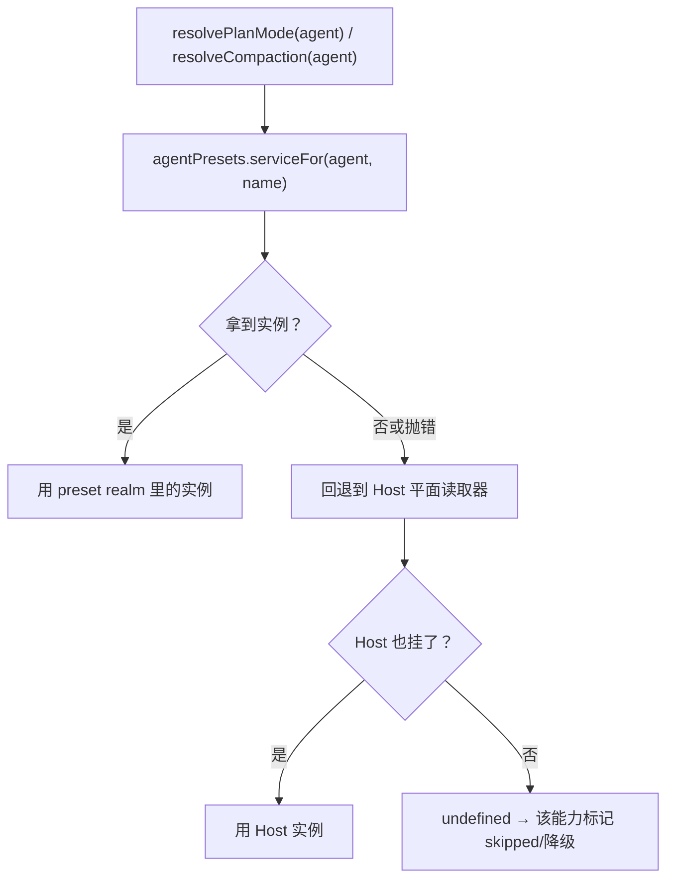
```mermaid
flowchart TD
  Q["resolvePlanMode(agent) / resolveCompaction(agent)"] --> P["agentPresets.serviceFor(agent, name)"]
  P --> P1{"拿到实例？"}
  P1 -->|是| OK["用 preset realm 里的实例"]
  P1 -->|否或抛错| H["回退到 Host 平面读取器"]
  H --> H1{"Host 也挂了？"}
  H1 -->|是| OK2["用 Host 实例"]
  H1 -->|否| NO["undefined → 该能力标记 skipped/降级"]
```

---

## 2. 触发源全景

| 触发源 | 入口 | action kind | trigger |
|---|---|---|---|
| `/handoff` | `command.ts:57` → `armWithAbort` | handoff | manual |
| `/handoff retry` | `command.ts:64` → `coordinator.retry` | 上一次的 kind | manual |
| 阈值自动 | `coordinator.observe` → `decideAutoAction` | handoff 或 compact | threshold |
| 设置卡「立即迁移」按钮 | `POST /dsh-auto-handoff/handoff` | handoff | manual |
| 设置卡「重试」按钮 | `POST /dsh-auto-handoff/retry` | 上一次的 kind | manual |

四条手动入口最终都收敛到**同一个** `Coordinator.arm()`，因此守卫、阶段机、闩锁只有一份实现。

---

## 3. 手动 `/handoff` 全链路

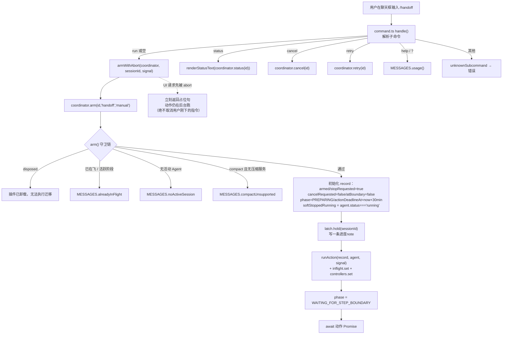
```mermaid
flowchart TD
  U["用户在聊天框输入 /handoff"] --> P["command.ts handle()<br/>解析子命令"]
  P -->|run 或空| R1["armWithAbort(coordinator, sessionId, signal)"]
  P -->|status| S1["renderStatusText(coordinator.status(id))"]
  P -->|cancel| C1["coordinator.cancel(id)"]
  P -->|retry| T1["coordinator.retry(id)"]
  P -->|help / ?| H1["MESSAGES.usage()"]
  P -->|其他| E1["unknownSubcommand → 错误"]

  R1 --> G1["coordinator.arm(id,'handoff','manual')"]
  R1 -.->|"UI 请求先被 abort"| AB["立刻返回占位句<br/>动作仍在后台跑<br/>（绝不取消用户刚下的指令）"]

  G1 --> AR{"arm() 守卫链"}
  AR -->|"disposed"| X1["插件已卸载，无法执行迁移"]
  AR -->|"已在飞 / 活跃阶段"| X2["MESSAGES.alreadyInFlight"]
  AR -->|"无活动 Agent"| X3["MESSAGES.noActiveSession"]
  AR -->|"compact 且无压缩服务"| X4["MESSAGES.compactUnsupported"]
  AR -->|通过| SET["初始化 record：<br/>armed/stopRequested=true<br/>cancelRequested=false/atBoundary=false<br/>phase=PREPARING/actionDeadlineAt=now+30min<br/>softStoppedRunning = agent.status==='running'"]
  SET --> LATCH["latch.hold(sessionId)<br/>写一条进度note"]
  LATCH --> RUN["runAction(record, agent, signal)<br/>+ inflight.set + controllers.set"]
  RUN --> PH["phase = WAITING_FOR_STEP_BOUNDARY"]
  PH --> AWAIT["await 动作 Promise"]
```

---

## 4. `runAction()`：先等边界，再决定做什么（coordinator.ts:373）

**核心设计：全程不调用 `agent.cancel()`。** 只抬闩锁 + `agent.whenIdle()`，让**当前 Step（含在飞的工具调用与文件写入）正常跑完并提交**，只拒绝**下一个** Step。

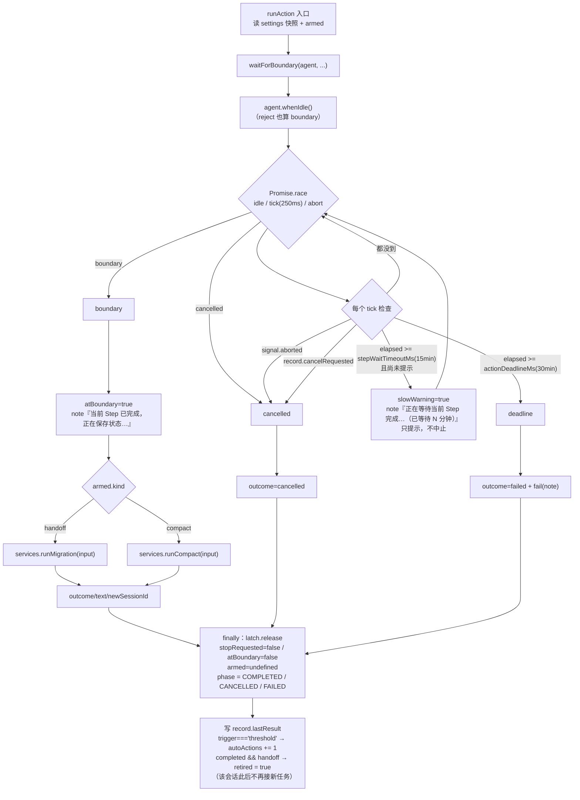
```mermaid
flowchart TD
  A["runAction 入口<br/>读 settings 快照 + armed"] --> W["waitForBoundary(agent, ...)"]
  W --> WT["agent.whenIdle()<br/>（reject 也算 boundary）"]
  WT --> LOOP{"Promise.race<br/>idle / tick(250ms) / abort"}
  LOOP -->|boundary| B["boundary"]
  LOOP -->|cancelled| C["cancelled"]
  LOOP --> T{"每个 tick 检查"}
  T -->|"signal.aborted"| C
  T -->|"record.cancelRequested"| C
  T -->|"elapsed >= actionDeadlineMs(30min)"| D["deadline"]
  T -->|"elapsed >= stepWaitTimeoutMs(15min)<br/>且尚未提示"| SLOW["slowWarning=true<br/>note『正在等待当前 Step 完成…（已等待 N 分钟）』<br/>只提示，不中止"]
  SLOW --> LOOP
  T -->|"都没到"| LOOP

  B --> NOTE["atBoundary=true<br/>note『当前 Step 已完成，正在保存状态…』"]
  NOTE --> KIND{"armed.kind"}
  KIND -->|handoff| MIG["services.runMigration(input)"]
  KIND -->|compact| CMP["services.runCompact(input)"]
  C --> OUT1["outcome=cancelled"]
  D --> OUT2["outcome=failed + fail(note)"]
  MIG --> RES["outcome/text/newSessionId"]
  CMP --> RES
  RES --> FIN["finally：latch.release<br/>stopRequested=false / atBoundary=false<br/>armed=undefined<br/>phase = COMPLETED / CANCELLED / FAILED"]
  OUT1 --> FIN
  OUT2 --> FIN
  FIN --> ACC["写 record.lastResult<br/>trigger==='threshold' → autoActions += 1<br/>completed && handoff → retired = true<br/>（该会话此后不再接新任务）"]
```

---

## 5. `runMigration()`：一次迁移的 9 个阶段（session-migration.ts:195）

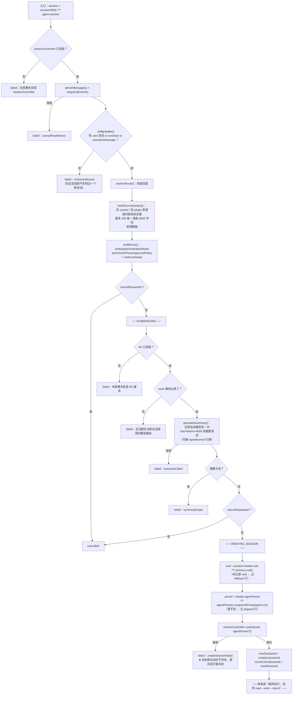
```mermaid
flowchart TD
  S0["入口：session = sessionOf(id) ?? agent.session"] --> D0{"sessionController 已安装？"}
  D0 -->|否| F0["failed：本部署未安装 sessionController"]
  D0 -->|是| H0["deriveMessages() + snapshotEvents()"]
  H0 -->|抛错| F1["failed：cannotReadHistory"]
  H0 --> M0{"isMigratable()<br/>有 user 消息 or turn/start or assistant/message ？"}
  M0 -->|否| F2["failed：noActiveSession<br/>（空白会话绝不复制出一个新会话）"]
  M0 -->|是| RT["resolveRoute()：四级回退"]
  RT --> TR["buildSummaryInput()：<br/>丢 system / 丢 plugin 来源<br/>按内容指纹去重<br/>最多 200 条 × 每条 8000 字符<br/>密钥脱敏"]
  TR --> FA["buildFacts()：<br/>workspace/route/planMode/<br/>permissionPreset/approvalPolicy<br/>+ readLastStep()"]
  FA --> CC{"cancelRequested ?"}
  CC -->|是| XC["cancelled"]
  CC -->|否| SS["── SUMMARIZING ──"]

  SS --> L0{"llm 已安装？"}
  L0 -->|否| F3["failed：本部署未安装 llm 服务"]
  L0 -->|是| R0{"route 解析出来了？"}
  R0 -->|否| F4["failed：无法解析当前会话使用的模型路由"]
  R0 -->|是| GEN["generateSummary()：<br/>对原会话模型发一次<br/>maxTokens=4096 的摘要请求<br/>（可被 signal/cancel 打断）"]
  GEN -->|抛错| F5["failed：summaryFailed"]
  GEN --> E0{"摘要为空？"}
  E0 -->|是| F6["failed：summaryEmpty"]
  E0 -->|否| CC2{"cancelRequested ?"}
  CC2 -->|是| XC
  CC2 -->|否| CS["── CREATING_SESSION ──"]

  CS --> CWD["cwd = session.header.cwd ?? process.cwd()<br/>（未记录 cwd → 记 fallback 行）"]
  CWD --> PRE["preset = header.agentPreset<br/>?? agentPresets.composedPreset(agent.ctx)<br/>（拿不到 → 记 skipped 行）"]
  PRE --> CREATE["sessionController.create({cwd, agentPreset?})"]
  CREATE -->|抛错| F7["failed：createSessionFailed<br/>★ 此刻新会话尚不存在，原会话分毫未动"]
  CREATE -->|成功| WIRE["newSessionId = created.sessionId<br/>record.newSessionId = newSessionId"]
  WIRE --> INH["── 继承段（顺序执行，逐项 read→write→report）──"]
```

### 5.1 继承段：六步，任何一步失败都只记一行，绝不回滚

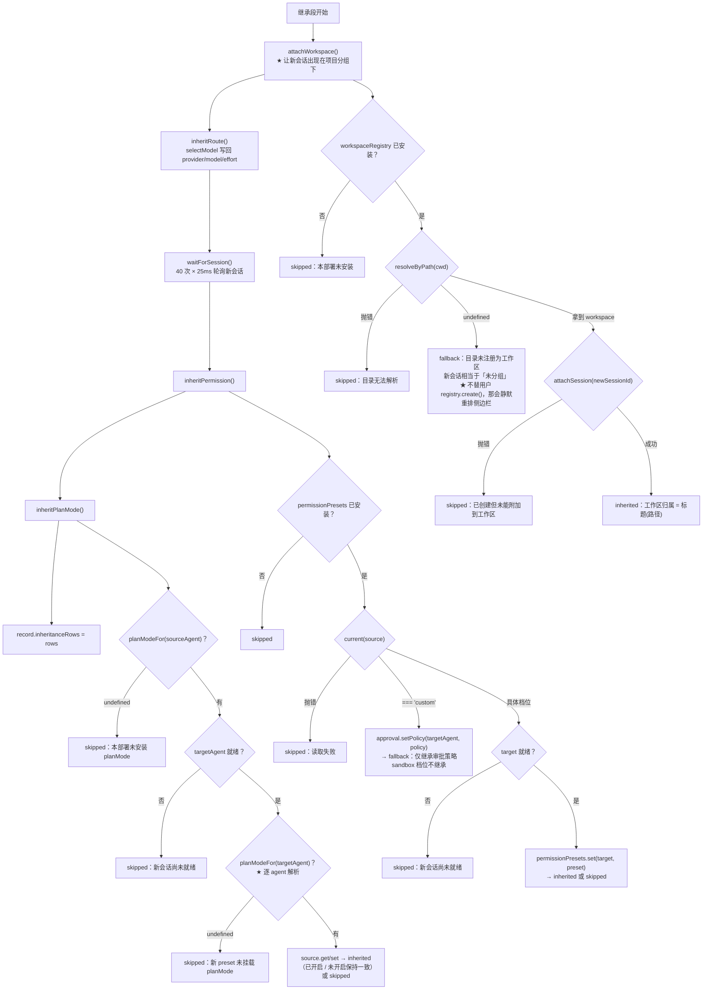
```mermaid
flowchart TD
  I["继承段开始"] --> W1["attachWorkspace()<br/>★ 让新会话出现在项目分组下"]
  W1 --> W2["inheritRoute()<br/>selectModel 写回 provider/model/effort"]
  W2 --> W3["waitForSession()<br/>40 次 × 25ms 轮询新会话"]
  W3 --> W4["inheritPermission()"]
  W4 --> W5["inheritPlanMode()"]
  W5 --> W6["record.inheritanceRows = rows"]

  W1 --> W1A{"workspaceRegistry 已安装？"}
  W1A -->|否| W1S["skipped：本部署未安装"]
  W1A -->|是| W1B{"resolveByPath(cwd)"}
  W1B -->|抛错| W1S2["skipped：目录无法解析"]
  W1B -->|undefined| W1F["fallback：目录未注册为工作区<br/>新会话相当于「未分组」<br/>★ 不替用户 registry.create()，那会静默重排侧边栏"]
  W1B -->|拿到 workspace| W1C{"attachSession(newSessionId)"}
  W1C -->|抛错| W1S3["skipped：已创建但未能附加到工作区"]
  W1C -->|成功| W1I["inherited：工作区归属 = 标题(路径)"]

  W4 --> P1{"permissionPresets 已安装？"}
  P1 -->|否| P1S["skipped"]
  P1 -->|是| P2{"current(source)"}
  P2 -->|抛错| P2S["skipped：读取失败"]
  P2 -->|"=== 'custom'"| P3["approval.setPolicy(targetAgent, policy)<br/>→ fallback：仅继承审批策略<br/>sandbox 档位不继承"]
  P2 -->|具体档位|c1{"target 就绪？"}
  c1 -->|否| P4S["skipped：新会话尚未就绪"]
  c1 -->|是| P5["permissionPresets.set(target, preset)<br/>→ inherited 或 skipped"]

  W5 --> L1{"planModeFor(sourceAgent)？"}
  L1 -->|undefined| L1S["skipped：本部署未安装 planMode"]
  L1 -->|有| L2{"targetAgent 就绪？"}
  L2 -->|否| L2S["skipped：新会话尚未就绪"]
  L2 -->|是| L3{"planModeFor(targetAgent)？<br/>★ 逐 agent 解析"}
  L3 -->|undefined| L3S["skipped：新 preset 未挂载 planMode"]
  L3 -->|有| L4["source.get/set → inherited<br/>（已开启 / 未开启保持一致）或 skipped"]
```

### 5.2 交付段与收尾

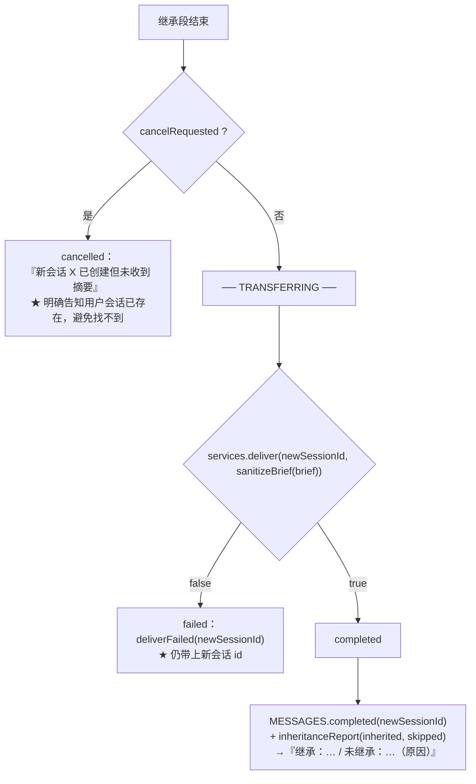
```mermaid
flowchart TD
  A["继承段结束"] --> C{"cancelRequested ?"}
  C -->|是| CX["cancelled：<br/>『新会话 X 已创建但未收到摘要』<br/>★ 明确告知用户会话已存在，避免找不到"]
  C -->|否| P["── TRANSFERRING ──"]
  P --> D{"services.deliver(newSessionId, sanitizeBrief(brief))"}
  D -->|false| DF["failed：deliverFailed(newSessionId)<br/>★ 仍带上新会话 id"]
  D -->|true| OK["completed"]
  OK --> RPT["MESSAGES.completed(newSessionId)<br/>+ inheritanceReport(inherited, skipped)<br/>→『继承：… / 未继承：…（原因）』"]
```

`deliver()` 的实现（index.ts:246）：拿 `agentOf(sessionId)`，用 `agent.followup(buildBriefMessage(text))` 注入一条 `source.kind === 'plugin'` 的用户消息 —— 这保证摘要**不会**被 `buildSummaryInput` 在下一轮迁移时重新喂给模型（plugin 来源被丢弃）。

---

## 6. 阈值自动触发（`session/event` → `observe`）

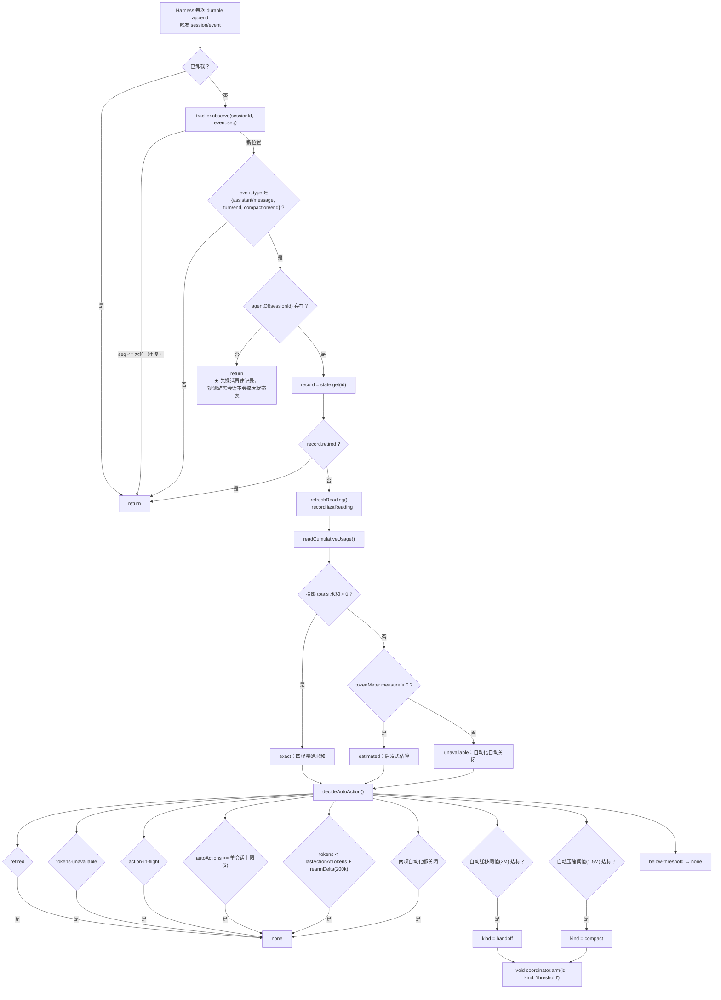
```mermaid
flowchart TD
  E["Harness 每次 durable append<br/>触发 session/event"] --> D1{"已卸载？"}
  D1 -->|是| Z["return"]
  D1 -->|否| W["tracker.observe(sessionId, event.seq)"]
  W -->|"seq <= 水位（重复）"| Z
  W -->|新位置| T{"event.type ∈<br/>{assistant/message, turn/end, compaction/end} ?"}
  T -->|否| Z
  T -->|是| AG{"agentOf(sessionId) 存在？"}
  AG -->|否| Z2["return<br/>★ 先探活再建记录，<br/>观测游离会话不会撑大状态表"]
  AG -->|是| GD["record = state.get(id)"]
  GD --> RT{"record.retired ?"}
  RT -->|是| Z
  RT -->|否| RR["refreshReading()<br/>→ record.lastReading"]

  RR --> READ["readCumulativeUsage()"]
  READ --> RD1{"投影 totals 求和 > 0 ?"}
  RD1 -->|是| EX["exact：四桶精确求和"]
  RD1 -->|否| RD2{"tokenMeter.measure > 0 ?"}
  RD2 -->|是| ES["estimated：启发式估算"]
  RD2 -->|否| UN["unavailable：自动化自动关闭"]

  EX --> DEC["decideAutoAction()"]
  ES --> DEC
  UN --> DEC
  DEC --> K1{"retired"} -->|是| N["none"]
  DEC --> K2{"tokens-unavailable"} -->|是| N
  DEC --> K3{"action-in-flight"} -->|是| N
  DEC --> K4{"autoActions >= 单会话上限(3)"} -->|是| N
  DEC --> K5{"tokens < lastActionAtTokens + rearmDelta(200k)"} -->|是| N
  DEC --> K6{"两项自动化都关闭"} -->|是| N
  DEC --> K7{"自动迁移阈值(2M) 达标？"} -->|是| H["kind = handoff"]
  DEC --> K8{"自动压缩阈值(1.5M) 达标？"} -->|是| CP["kind = compact"]
  DEC --> K9["below-threshold → none"]
  H --> ARM["void coordinator.arm(id, kind, 'threshold')"]
  CP --> ARM
```

顺序不可调换：**handoff 优先于 compact**；`retired` / 无精确读数 / 已在飞 / 预算耗尽 / 未重臂 / 全局关闭 六道闸门全在前面。

---

## 7. 自动压缩（`runCompact`，compact-handler.ts:73）

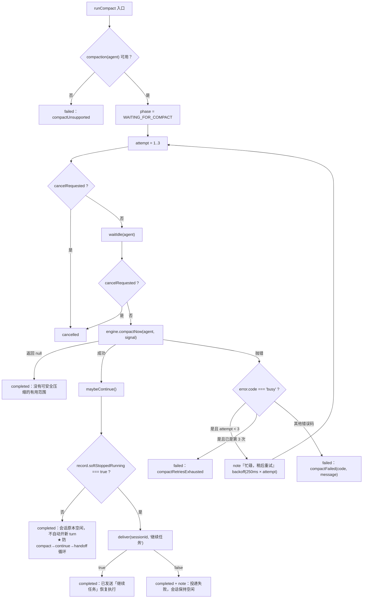
```mermaid
flowchart TD
  S["runCompact 入口"] --> E{"compaction(agent) 可用？"}
  E -->|否| F0["failed：compactUnsupported"]
  E -->|是| PH["phase = WAITING_FOR_COMPACT"]
  PH --> RETRY["attempt = 1..3"]
  RETRY --> C1{"cancelRequested ?"}
  C1 -->|是| X["cancelled"]
  C1 -->|否| IDLE["waitIdle(agent)"]
  IDLE --> C2{"cancelRequested ?"}
  C2 -->|是| X
  C2 -->|否| NOW["engine.compactNow(agent, signal)"]
  NOW -->|"返回 null"| OK0["completed：没有可安全压缩的有用范围"]
  NOW -->|成功| CONT["maybeContinue()"]
  NOW -->|抛错| ERR{"error.code === 'busy' ?"}
  ERR -->|"是且 attempt < 3"| BO["note『忙碌，稍后重试』<br/>backoff(250ms × attempt)"]
  BO --> RETRY
  ERR -->|"是且已是第 3 次"| F1["failed：compactRetriesExhausted"]
  ERR -->|其他错误码| F2["failed：compactFailed(code, message)"]

  CONT --> SR{"record.softStoppedRunning === true ?"}
  SR -->|否| NC["completed：会话原本空闲，<br/>不自动开新 turn<br/>★ 防 compact→continue→handoff 循环"]
  SR -->|是| DEL["deliver(sessionId, '继续任务')"]
  DEL -->|true| YC["completed：已发送「继续任务」恢复执行"]
  DEL -->|false| NC2["completed + note：投递失败，会话保持空闲"]
```

`softStoppedRunning` 在 `arm()` 里一次性快照（`agent.status === 'running'`），它是**「这次压缩到底打断了一个正在跑的 turn 没有」**的唯一依据。

---

## 8. `agent/pre-step` 软停止与人类提示守卫（coordinator.ts:222）

这是整套机制里最需要小心的一处：拒绝一个 Step 会**丢弃它已申领的消息**，所以必须先把人类输入摘出来。

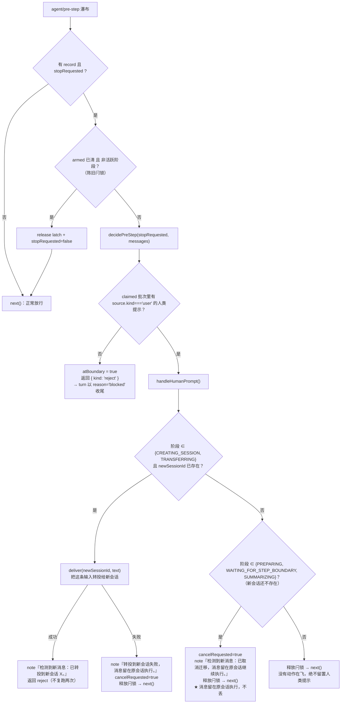
```mermaid
flowchart TD
  PS["agent/pre-step 瀑布"] --> A{"有 record 且 stopRequested ?"}
  A -->|否| NEXT["next()：正常放行"]
  A -->|是| B{"armed 已清 且 非活跃阶段？<br/>（陈旧闩锁）"}
  B -->|是| REL["release latch + stopRequested=false"] --> NEXT
  B -->|否| C["decidePreStep(stopRequested, messages)"]
  C --> D{"claimed 批次里有 source.kind==='user' 的人类提示？"}
  D -->|否| REJ["atBoundary = true<br/>返回 { kind: 'reject' }<br/>→ turn 以 reason='blocked' 收尾"]
  D -->|是| HP["handleHumanPrompt()"]

  HP --> P1{"阶段 ∈ {CREATING_SESSION, TRANSFERRING}<br/>且 newSessionId 已存在？"}
  P1 -->|是| P2["deliver(newSessionId, text)<br/>把这条输入转投给新会话"]
  P2 -->|成功| P2R["note『检测到新消息：已转投到新会话 X。』<br/>返回 reject（不复跑两次）"]
  P2 -->|失败| P2F["note『转投到新会话失败，消息留在原会话执行。』<br/>cancelRequested=true<br/>释放闩锁 → next()"]
  P1 -->|否| P3{"阶段 ∈ {PREPARING, WAITING_FOR_STEP_BOUNDARY, SUMMARIZING}？<br/>（新会话还不存在）"}
  P3 -->|是| P3R["cancelRequested=true<br/>note『检测到新消息：已取消迁移，消息留在原会话继续执行。』<br/>释放闩锁 → next()<br/>★ 消息留在原会话执行，不丢"]
  P3 -->|否| P4["释放闩锁 → next()<br/>没有动作在飞，绝不留置人类提示"]
```

三种结局的语义差别：

| 阶段 | 用户此刻发消息 | 结果 |
|---|---|---|
| PRE_SESSION（新会话未建） | 放弃本次迁移 | 消息在原会话执行 |
| POST_SESSION（新会话已建） | 消息转投新会话 | 新会话继续干活 |
| 无动作 | 直接放行 | 不干预 |

---

## 9. 客户端自动跳转（follow.ts:70）

上一轮修复的正是这张图 —— 跟随器从「设置卡内」搬到「`apply()` 常驻」。

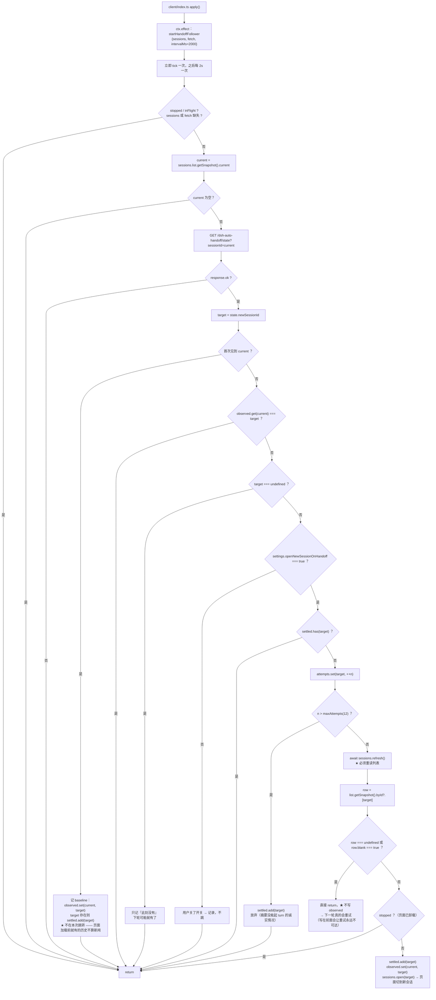
```mermaid
flowchart TD
  AP["client/index.ts apply()"] --> EF["ctx.effect：startHandoffFollower<br/>{sessions, fetch, intervalMs=2000}"]
  EF --> TICK["立即 tick 一次，之后每 2s 一次"]
  TICK --> G0{"stopped / inFlight ?<br/>sessions 或 fetch 缺失 ?"}
  G0 -->|是| OUT["return"]
  G0 -->|否| CUR["current = sessions.list.getSnapshot().current"]
  CUR --> G1{"current 为空？"}
  G1 -->|是| OUT
  G1 -->|否| GET["GET /dsh-auto-handoff/state?sessionId=current"]
  GET --> G2{"response.ok ?"}
  G2 -->|否| OUT
  G2 -->|是| TGT["target = state.newSessionId"]

  TGT --> B1{"首次见到 current ？"}
  B1 -->|是| BASE["记 baseline：observed.set(current, target)<br/>target 存在则 settled.add(target)<br/>★ 不在本次跳转 —— 页面加载前就有的历史不算新闻"] --> OUT
  B1 -->|否| B2{"observed.get(current) === target ？"}
  B2 -->|是| OUT
  B2 -->|否| B3{"target === undefined ？"}
  B3 -->|是| B3R["只记『此刻没有』<br/>下轮可能就有了"] --> OUT
  B3 -->|否| B4{"settings.openNewSessionOnHandoff === true ？"}
  B4 -->|否| B4R["用户关了开关 → 记录，不跳"] --> OUT
  B4 -->|是| B5{"settled.has(target) ？"}
  B5 -->|是| OUT
  B5 -->|否| ATT["attempts.set(target, ++n)"]
  ATT --> B6{"n > maxAttempts(12) ？"}
  B6 -->|是| B6R["settled.add(target)<br/>放弃（摘要没能起 turn 的诚实情况）"] --> OUT
  B6 -->|否| REF["await sessions.refresh()<br/>★ 必须重读列表"]

  REF --> ROW["row = list.getSnapshot().byId?.[target]"]
  ROW --> B7{"row === undefined 或 row.blank === true ？"}
  B7 -->|是| RET["直接 return，★ 不写 observed<br/>→ 下一轮真的会重试<br/>（写在前面会让重试永远不可达）"]
  B7 -->|否| B8{"stopped ？（页面已卸载）"}
  B8 -->|是| OUT
  B8 -->|否| GO["settled.add(target)<br/>observed.set(current, target)<br/>sessions.open(target) → 页面切到新会话"]
```

两个必须写进注释的 Harness 事实：

1. **`blank` 标记**：Host 在 `session/created` 时发出 `api-session/added`，此刻日志里只有 header，于是该行带 `blank: true`；客户端列表 store **没有**任何后续事件会清掉它 —— 只有一次列表重读（`applySessionListMetadata` 在 `turn/start` 时清）才行。工作区浏览器**默认隐藏 blank 行**（除非它是当前选中项）。所以 `refresh()` 是「让新会话可见」的唯一手段，`open()` 单独调用会切到一个侧边栏仍拒绝显示的行。
2. **baseline 规则**：首次观测只记录不动作，否则每次页面加载都会把用户从当前会话劫持走。

---

## 10. HTTP 状态通道（routes.ts:118）

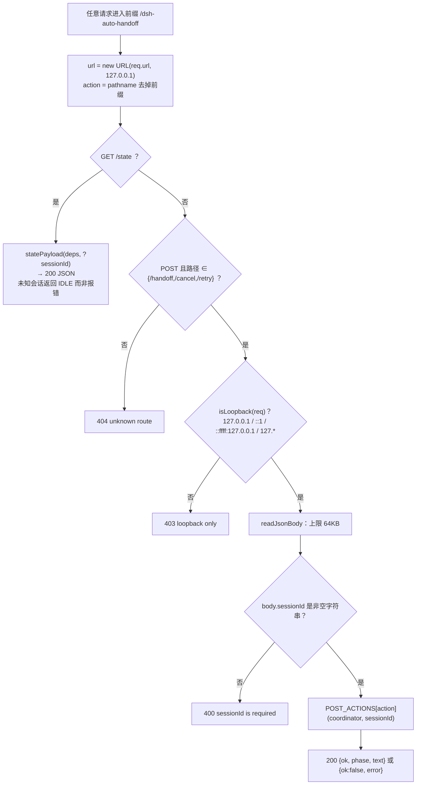
```mermaid
flowchart TD
  R["任意请求进入前缀 /dsh-auto-handoff"] --> U["url = new URL(req.url, 127.0.0.1)<br/>action = pathname 去掉前缀"]
  U --> M1{"GET /state ？"}
  M1 -->|是| P1["statePayload(deps, ?sessionId)<br/>→ 200 JSON<br/>未知会话返回 IDLE 而非报错"]
  M1 -->|否| M2{"POST 且路径 ∈ {/handoff,/cancel,/retry} ？"}
  M2 -->|否| N1["404 unknown route"]
  M2 -->|是| L{"isLoopback(req)？<br/>127.0.0.1 / ::1 / ::ffff:127.0.0.1 / 127.*"}
  L -->|否| N2["403 loopback only"]
  L -->|是| BD["readJsonBody：上限 64KB"]
  BD --> S{"body.sessionId 是非空字符串？"}
  S -->|否| N3["400 sessionId is required"]
  S -->|是| ACT["POST_ACTIONS[action](coordinator, sessionId)"]
  ACT --> OK["200 {ok, phase, text} 或 {ok:false, error}"]
```

响应**只有标量**：任何活的 Harness 对象都不过线。`cache-control: no-store` 防止浏览器缓存状态。

---

## 11. 设置卡（client/card.ts，独立于跟随器）

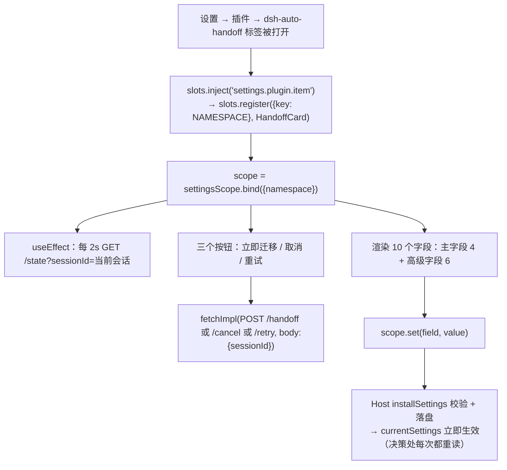
```mermaid
flowchart TD
  M["设置 → 插件 → dsh-auto-handoff 标签被打开"] --> B1["slots.inject('settings.plugin.item')<br/>→ slots.register({key: NAMESPACE}, HandoffCard)"]
  B1 --> C1["scope = settingsScope.bind({namespace})"]
  C1 --> P1["useEffect：每 2s GET /state?sessionId=当前会话"]
  C1 --> P2["渲染 10 个字段：主字段 4 + 高级字段 6"]
  C1 --> P3["三个按钮：立即迁移 / 取消 / 重试"]
  P3 --> F1["fetchImpl(POST /handoff 或 /cancel 或 /retry, body:{sessionId})"]
  P2 --> F2["scope.set(field, value)"]
  F2 --> SR["Host installSettings 校验 + 落盘<br/>→ currentSettings 立即生效（决策处每次都重读）"]
```

设置卡**不负责跳转**：跳转只在跟随器里（见 §9）。卡片只在设置标签挂载时存在，而 `/handoff` 通常在聊天里输入 —— 这就是旧的「迁移了但不跳转」缺陷的成因。

---

## 12. 状态机（`HandoffPhase`）

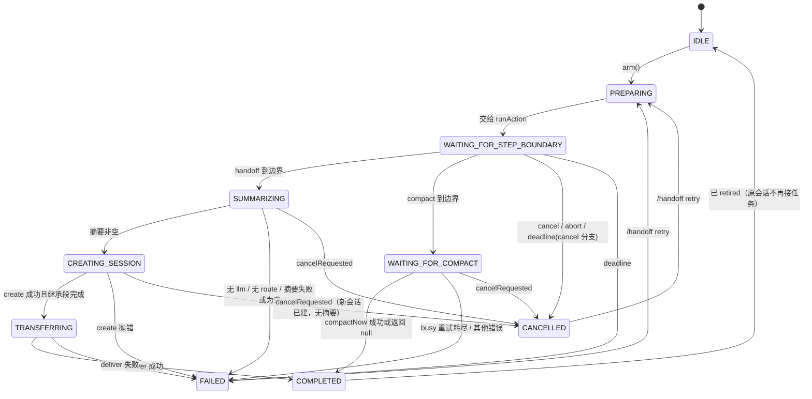
```mermaid
stateDiagram-v2
  [*] --> IDLE
  IDLE --> PREPARING: arm()
  PREPARING --> WAITING_FOR_STEP_BOUNDARY: 交给 runAction
  WAITING_FOR_STEP_BOUNDARY --> SUMMARIZING: handoff 到边界
  WAITING_FOR_STEP_BOUNDARY --> WAITING_FOR_COMPACT: compact 到边界
  WAITING_FOR_STEP_BOUNDARY --> CANCELLED: cancel / abort / deadline(cancel 分支)
  WAITING_FOR_STEP_BOUNDARY --> FAILED: deadline
  SUMMARIZING --> CREATING_SESSION: 摘要非空
  SUMMARIZING --> FAILED: 无 llm / 无 route / 摘要失败或为空
  SUMMARIZING --> CANCELLED: cancelRequested
  CREATING_SESSION --> TRANSFERRING: create 成功且继承段完成
  CREATING_SESSION --> FAILED: create 抛错
  CREATING_SESSION --> CANCELLED: cancelRequested（新会话已建，无摘要）
  TRANSFERRING --> COMPLETED: deliver 成功
  TRANSFERRING --> FAILED: deliver 失败
  WAITING_FOR_COMPACT --> COMPLETED: compactNow 成功或返回 null
  WAITING_FOR_COMPACT --> FAILED: busy 重试耗尽 / 其他错误
  WAITING_FOR_COMPACT --> CANCELLED: cancelRequested
  COMPLETED --> IDLE: 已 retired（原会话不再接任务）
  FAILED --> PREPARING: /handoff retry
  CANCELLED --> PREPARING: /handoff retry
```

活跃阶段（`isActivePhase`）= `PREPARING` / `WAITING_FOR_STEP_BOUNDARY` / `SUMMARIZING` / `CREATING_SESSION` / `TRANSFERRING` / `WAITING_FOR_COMPACT`。处于其中任一阶段时 `arm()` 拒绝再次入队 —— **每会话同时只有一个动作**。

---

## 13. 事件订阅与卸载

| 事件 | 处理函数 | 作用 |
|---|---|---|
| `agent/pre-step` | `coordinator.handlePreStep` | 软停止闩锁：拒绝下一个 Step，抢救人类提示 |
| `agent/status` | `coordinator.noteAgentStatus` | `idle` 且 stopRequested → 认为已到边界 |
| `agent/error` | `coordinator.noteAgentError` | 记一条失败 note |
| `session/event` | `coordinator.observe` | 水位去重 + 阈值决策（§6） |
| `agent/disposed` | `coordinator.releaseSession` | 释放闩锁、删记录、重置水位 |
| `session/disposed` | `coordinator.releaseSession` | 同上 |

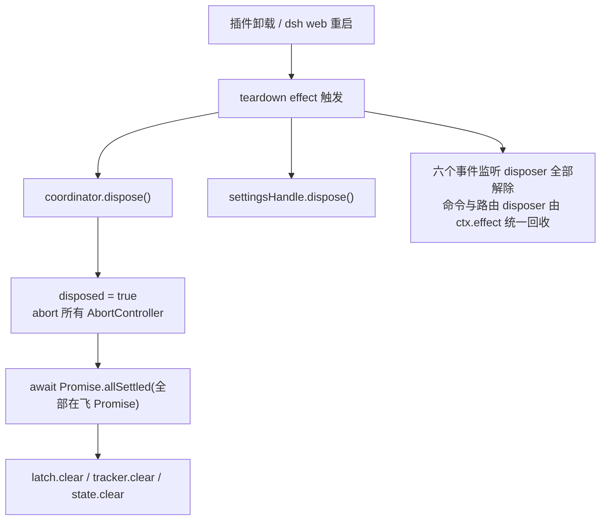
```mermaid
flowchart TD
  U["插件卸载 / dsh web 重启"] --> D["teardown effect 触发"]
  D --> D1["coordinator.dispose()"]
  D1 --> D2["disposed = true<br/>abort 所有 AbortController"]
  D2 --> D3["await Promise.allSettled(全部在飞 Promise)"]
  D3 --> D4["latch.clear / tracker.clear / state.clear"]
  D --> D5["settingsHandle.dispose()"]
  D --> D6["六个事件监听 disposer 全部解除<br/>命令与路由 disposer 由 ctx.effect 统一回收"]
```

---

## 14. 降级矩阵（任一可选服务缺失时的行为）

| 缺失的服务 | 后果 | 是否致命 |
|---|---|---|
| `commands` | `/handoff` 不存在 | **致命**（唯一硬依赖，`inject`） |
| `sessionController` | 迁移第一步即 failed「本部署未安装」 | 迁移不可用 |
| `llm` | 摘要失败 → failed | 迁移不可用 |
| `agentDefaultModel` | 仅当其他三级 route 回退都失败才影响 | 可降级 |
| `workspaceRegistry` | 新会话**未分组**（`fallback` 行明说） | 不致命，仅可见性 |
| `permissionPresets` | 权限行 `skipped` | 不致命 |
| `approval` | `custom` 档位无法继承审批策略 | 不致命 |
| `planMode` | Plan 模式行 `skipped` | 不致命 |
| `compaction` | 自动压缩不可用（`compactUnsupported`） | 不影响迁移 |
| `tokenMeter` / `sessionProjections` | 读数 `unavailable` → **自动化整体关闭** | 手动迁移仍可用 |
| `agents` / `sessions` | 找不到 agent/session → `noActiveSession` | 迁移不可用 |
| `webServer` | 无 HTTP 状态通道：卡片退化为「仅设置」，跟随器静默不跳 | 不致命 |
